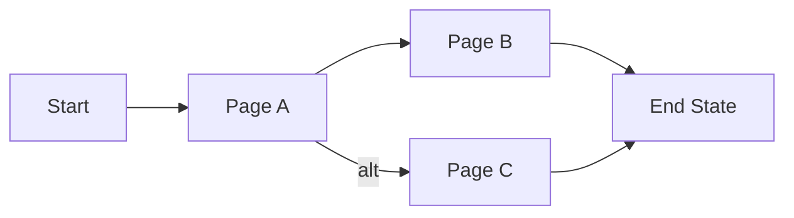

# [Product/Feature Name] PRD

## Overview
Brief description of the product or feature (2-3 sentences).

## Problem Statement
- What problem are we solving?
- Who experiences this problem?
- What is the impact of not solving it?

## Goals & Objectives
- [Primary goal]
- [Secondary goals]

## Non-Functional Requirements
| ID | Requirement | Priority | Notes |
|----|-------------|----------|-------|
| NFR-001 | [description] | P0/P1/P2 | |

## User Stories

### [US-001] [Story Title]
**As a** [user type], **I want** [action] **so that** [benefit].

**Priority**: P0/P1/P2

**Acceptance Criteria**:
- [ ] Given [context], when [action], then [outcome]
- [ ] Given [context], when [action], then [outcome]
- [ ] [Additional criteria]

**Notes**: [Optional additional context]

---

### [US-002] [Story Title]
...

## Information Architecture

### Page Structure
| Page | Description | Key Components |
|------|-------------|----------------|
| [page name] | [purpose of this page] | [main elements/features] |

### User Flows
Describe how users navigate between pages to accomplish key tasks.

#### [Flow Name] (e.g., "User Registration Flow")

1. User starts at [page] and [action]
2. System [response], user sees [page]
3. User [action], flow completes

### Page Specifications
Detail the functional requirements for each key page.

#### [Page Name]
- **Purpose**: [why this page exists]
- **Entry Points**: [how users arrive here]
- **Features**:
  - [feature 1]
  - [feature 2]
- **Exit Points**: [where users can navigate to]
- **States**: [empty state, loading state, error state if applicable]

## Scope

### In Scope
- [item]

### Out of Scope
- [item]

## Dependencies
| Dependency | Owner | Status | Impact |
|------------|-------|--------|--------|
| [description] | [team/person] | [status] | [impact if blocked] |

## Risks & Mitigations
| Risk | Likelihood | Impact | Mitigation |
|------|------------|--------|------------|
| [description] | H/M/L | H/M/L | [strategy] |

## Open Questions
- [ ] [question]

## Appendix
[Additional context, research, diagrams, etc.]
